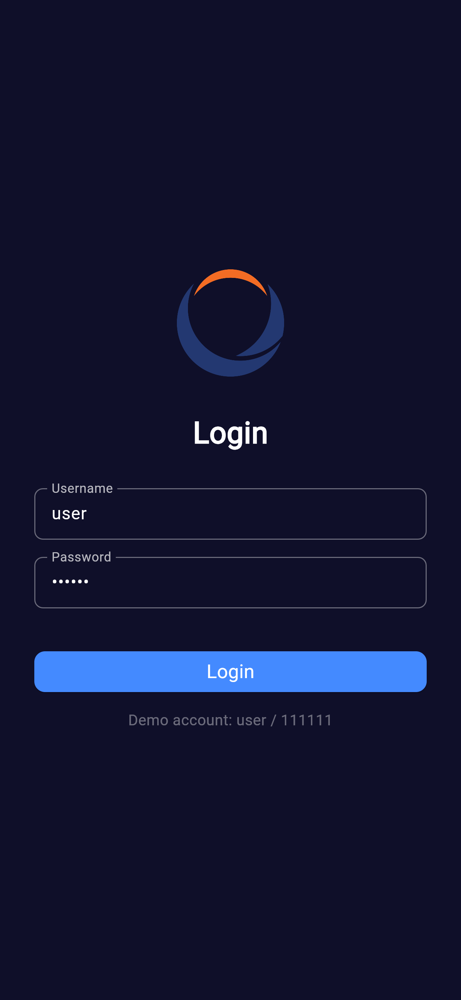
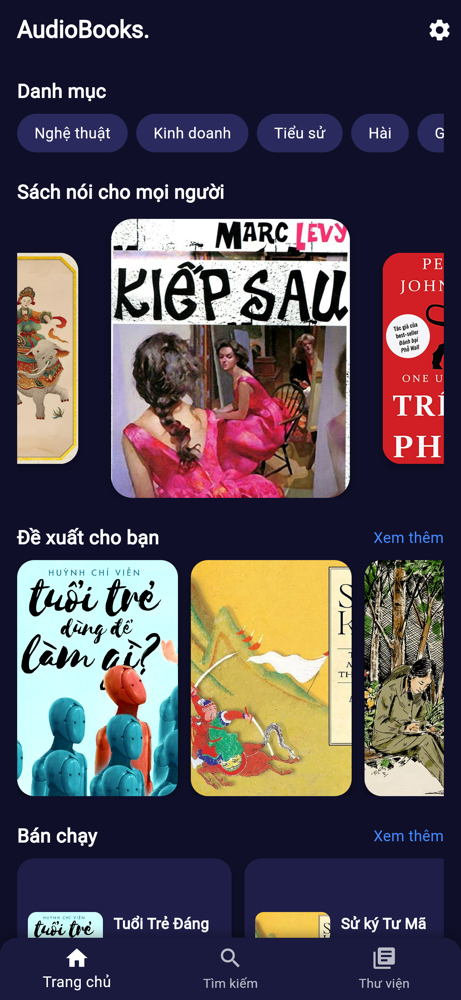
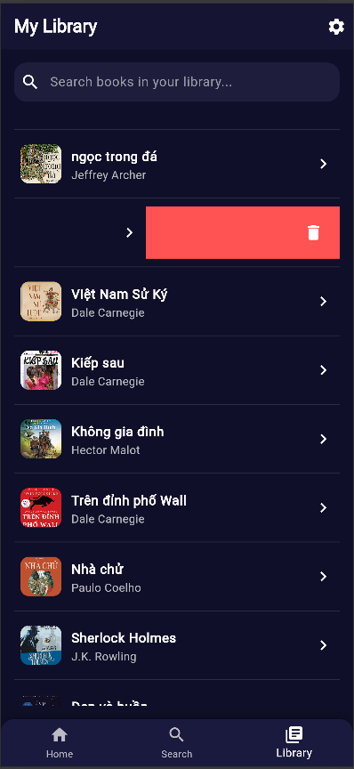
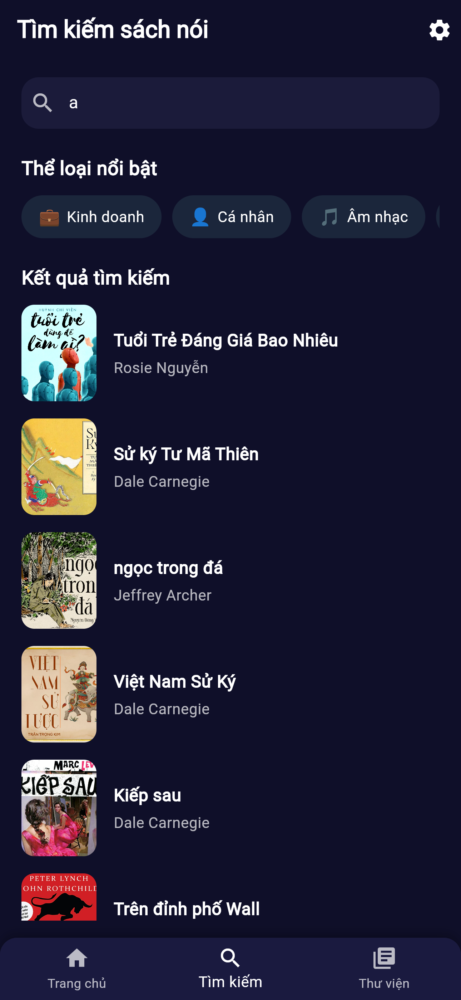
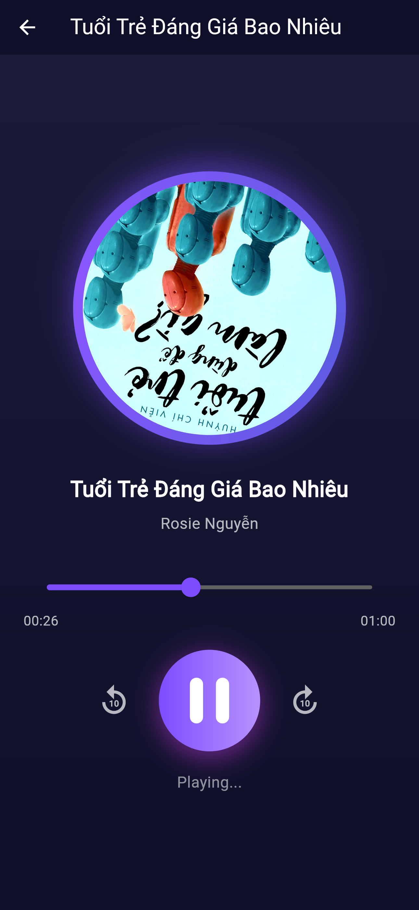
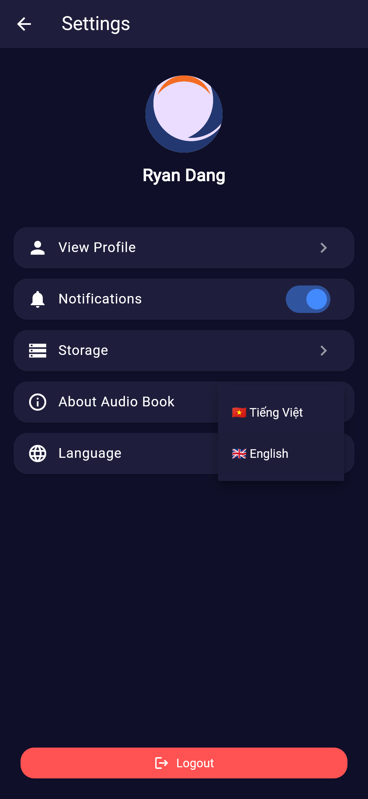

# 🎧 AudioBook - Ứng dụng Sách nói


**AudioBook** là một ứng dụng **nghe sách nói miễn phí**, đa nền tảng (Android, iOS, Web, Desktop) được phát triển bằng **Flutter** và **Hive**.  
Dự án được thực hiện trong khuôn khổ học phần **Lập trình cho Thiết bị Di động**, tập trung vào **thiết kế UI/UX hiện đại**.

---
### Link demo : 
---
## 📸 Giao diện & Tính năng Nổi bật

Ứng dụng mang đến trải nghiệm nghe sách nói hiện đại, trực quan và cá nhân hóa.

| Màn hình splash | Màn hình login | Màn hình Welcome | Màn hình Trang chủ | Màn hình Thư viện | Màn hình Chi tiết sách | Màn hình Tìm kiếm| Màn hình Phát |Màn hình Cài đặt | Màn hình profile |
| :---: | :---: | :---: | :---: | :---: | :---: | :---: | :---: | :---: | :---: |
|  |  | |  |  |  |  |  |  |  |

---

## 🌟 Tính năng Chính

- 🎨 **Thư viện sách nói** với ảnh bìa, tên, tác giả  
- 🔍 **Tìm kiếm thông minh** theo tên hoặc tác giả  
- ▶️ **Trình phát audio** (phát/tạm dừng, tua nhanh/chậm)  
- ❤️ **Lưu hoặc xóa sách yêu thích** trong thư viện cá nhân (vuốt để xóa)  
- 🌐 **Đa ngôn ngữ**: Tiếng Việt & Tiếng Anh (`easy_localization`)  
- 🌀 **Hiệu ứng carousel 3D** trong trang chủ  
- 📖 **Xem chi tiết sách**: tóm tắt, bình luận, và thông tin tác giả  
- 💾 **Quản lý dữ liệu bằng Hive** (lưu offline)  
- 🧭 **Điều hướng thông minh** và giao diện trực quan, hiện đại  

---

## 🛠️ Kiến trúc & Công nghệ

Dự án được xây dựng với kiến trúc tách lớp rõ ràng (Models – Screens – Widgets – Database).

| Thành phần | Công nghệ sử dụng |
|-------------|------------------|
| **Ngôn ngữ lập trình** | Flutter 3.x / Dart 3.x |
| **Cơ sở dữ liệu** | Hive (Local NoSQL Database) |
| **Phát audio** | audioplayers |
| **Đa ngôn ngữ** | easy_localization |
| **Phông chữ & UI** | google_fonts, carousel_slider |
| **Quản lý dữ liệu** | Hive Adapter (`audiobook.g.dart`) |

---

## 📂 Cấu trúc Thư mục

```bash
audio_book/
├── assets/
│   ├── audios/                 # File audio sách nói (mp3, wav, ...)
│   ├── images/                 # Ảnh bìa sách
│   ├── icons/                  # Icon ứng dụng
│   └── langs/                  # File ngôn ngữ (vi.json, en.json) dùng cho đa ngôn ngữ
│
├── lib/
│   ├── database/
│   │   └── app_database.dart          # Xử lý dữ liệu cục bộ bằng Hive
│   │
│   ├── models/
│   │   ├── audiobook.dart             # Định nghĩa model AudioBook
│   │   └── audiobook.g.dart           # File sinh tự động bởi Hive
│   │
│   ├── screens/                              # Các màn hình giao diện chính của ứng dụng
│   │   ├── book_detail_screen.dart                 
│   │   ├── book_in_library_screen.dart
│   │   ├── home_screen.dart
│   │   ├── library_screen.dart
│   │   ├── loading_screen.dart
│   │   ├── login_screen.dart
│   │   ├── main_menu_screen.dart
│   │   ├── more_books_screen.dart
│   │   ├── onboarding_screen.dart
│   │   ├── personalization_screen.dart
│   │   ├── player_screen.dart
│   │   ├── profile_screen.dart
│   │   ├── search_screen.dart
│   │   ├── setting_screen.dart
│   │   ├── splash_screen.dart
│   │   ├── studentinfo_screen.dart
│   │   └── welcome_screen.dart
│   │
│   ├── widgets/
│   │   └── book_card.dart             # Widget hiển thị sách
│   │
│   └── main.dart                      # Điểm khởi đầu của ứng dụng
│
├── pubspec.yaml                       # Khai báo thư viện và tài nguyên
└── README.md                          # Mô tả và hướng dẫn dự án

```
---
## Thông Tin Nhóm
| Thành viên | Mã số sinh viên | Email |
|-------------|------------------|------|
| Đặng Đắc Tú | 23010619 | 23010619@st.phenikaa-uni.edu.vn|

* **GitHub:** [github.com/Audio_Book_App](https://github.com/DangDacTu/2025_LTTBDD_N05_Nhom10)
---


